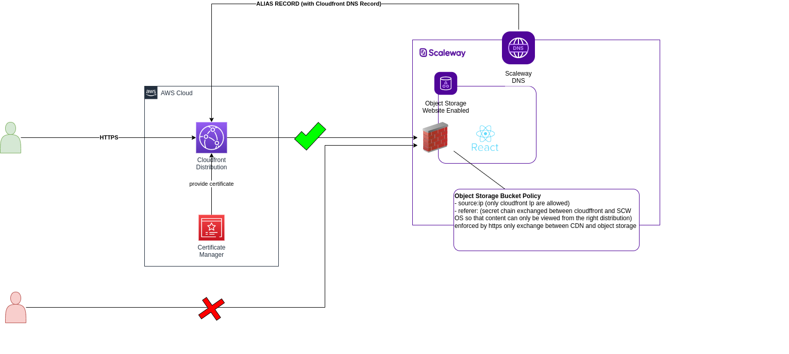

# Overview
The purpose of this project is to demonstrate how we can connect Scaleway Object Storage with  static web site feature enabled with a CDN.
Combining Object Storage with CDN could provides the following benefits :
- Customer Domain with SSL enabled on top of Scaleway Object Storage (feature not yet exists) 
- Better latency 



1. The Cloudfront distribution is exposed with an alias record resolved on Scaleway DNS service, as required by cloudfront the SSL Certificate is provided using AWS ACM
2. The user accesses to the static web site through a Cloudfront distribution 
3. Cloudfront connects to the Scaleway object storage to retrieve the content from the static website
4. The content of the Object storage can only be reached from the customer cloudfront distribution because a bucket policy has been associated to the bucket with the following conditions:
   - Cloudfront CDN IP restrictions
   - Referer header validation : secret characters chain exchanged between the cloudfront distribution and Scaleway object storage so that the content can only be viewed from the right distribution

**NB : The referer header validation is enforced using HTTPS connection between the CDN and Scaleway Object Storage**

# Deployment
## Prerequisites
### Accounts
- Scaleway account with an IAM Token with at least following permissions : 
    - ObjectStorageFullAccess
    - DomainsDNSFullAccess
- AWS account with with an IAM access key/secret key with at least following permissions : 
    - Cloudfront Full Access
    - AWS Certificate Manager Full Access
### Utils
- jq *required as part of cloudfront IP downloading and parsing*
- wget *required as part of cloudfront IP downloading and parsing*
- node~16.X.X *required as part of react project building with npm*
- Scaleway DNS Zone
- Terraform >= 1.2.X

***NB: Another Domain Registrar can be used but it may required a slight update of our terraform regarding CDN alias and ACM certificate validation see infrastructure/scw_dns.tf***

## Steps
1. Configure your environment variables, so that  Scaleway and AWS terraform providers can respectively interact with Scaleway and AWS API :
    - **Scaleway**
      - SCW_ACCESS_KEY
      - SCW_SECRET_KEY
      - SCW_DEFAULT_PROJECT_ID
      - SCW_DEFAULT_ORGANIZATION_ID
    - **AWS**
      - AWS_ACCESS_KEY_ID
      - AWS_SECRET_ACCESS_KEY

NB: See [here](https://registry.terraform.io/providers/scaleway/scaleway/latest/docs)

2. Run make init
```
make init
```
This script will do the following:
   - Download and parse the Cloudfront IP from the AWS provided url
   - Provide these as terraform variables(i.e. infrastructure/terraform.tfvars.json)
   - Build the react application
   - Initialize the terraform provider
3. Fill  file infrastructure/terraform.tfvars.json
   - scw_domain_zone 
   - web_bucket_name
4. Run make deploy
```
make deploy
```
This script validates the terraform files and applies them


5. The website is accessible from the url provided by the terraform output **cloudfront_url_web_app**.

**NB: To check that the bucket is only accessible from the cloudfront IP, users can try to curl the web_bucket_endpoint output. It should have a 403**

## Cleanup
Execute make clean-up at the root folder.
```
make clean-up
```